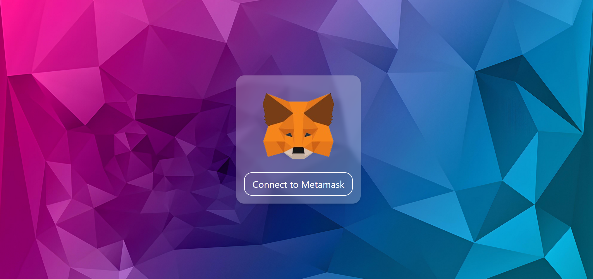
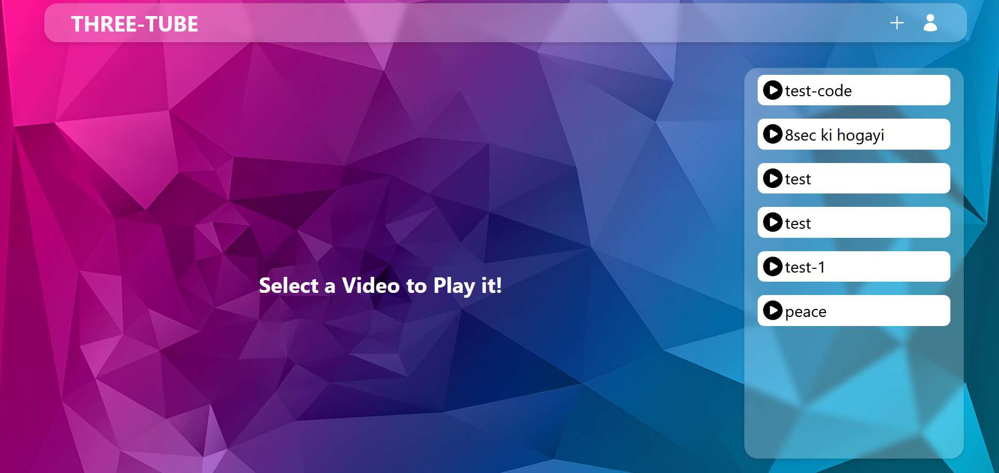
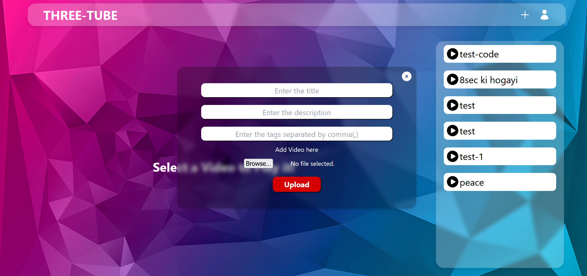
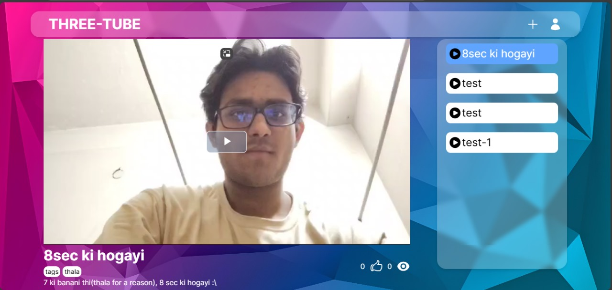

# ThreeTube
#### ThreeTube is a decentralized streaming platform that redefines media content ownership, empowering both creators and viewers. Built on blockchain technology, it prioritizes content security, user control, and fair monetization, while fostering a unique, engaging experience centered around community participation and rewards.

## Complete Idea with a Revenue Model
#### Here's a [ppt](https://www.canva.com/design/DAGVFv3zRSA/rHzQhXR-jrgJsYF4BrwNjQ/edit) about the entire project
#### Currently implemented features include video upload, decentralized storage, wallet-based access, indexing via The Graph, and **Livepeer-powered** live streaming.

## 💻 TechStack Used
#### <ul><li>JavaScript</li><li>Solidity</li><li>ReactJS</li><li>TailwindCSS</li><li>NodeJS</li><li>Web3.js</li><li>MongoDB</li><li>MetaMask</li><li>IPFS</li><li>PinataSDK</li><li>FFMPEG</li><li>GraphQL</li><li>Websockets</li><li>Ganache</li><li>Livepeer</li></ul>

## Prerequisites
#### Node.js should be installed on your system
#### Create two folders in the server : uploads and videos
### Go inside the client and server folder and do install a npm dependencies
```
cd client
cd server
npm install
```
#### FFMPEG should be downloaded on your local system
#### A MetaMask Account with some sepolia in sepolia's test network.
#### An account on IPFS and PinataSDK
#### Either MongoDB should be available on your local or make a account in MongoAtlas to use it without dowloading
#### <ul><li>[Node.js](https://nodejs.org/en/)</li><li>[MetaMask extension](https://microsoftedge.microsoft.com/addons/detail/metamask/ejbalbakoplchlghecdalmeeeajnimhm)</li><li>[FFMPEG(for Windows)](https://www.youtube.com/watch?v=4jx2_j5Seew)</li><li>[FFMPEG(MacOS)](https://www.youtube.com/watch?v=dJ8y-VlMNAo)</li><li>[MongoDB(local)](https://www.mongodb.com/docs/manual/installation/)</li><li>[MongoAtlas(Cloud)](https://www.youtube.com/watch?v=VkXvVOb99g0)</li><li>[IPFS](https://merrillinsurance.ipfs.com/)</li><li>[PinataSDK](https://pinata.cloud/)</li></ul>

## 🎪  Setting up .env Variables

#### First we need to configure a .env file for secret variables used

#### You need to add following varaibles in your .env file in the server folder:
```
1. DB = //This should be the connection URL of your MongoDB database 
2. NODE_ENV = //Set this as 'development' for running the project locally
3. PINATA_API_KEY = //You get this on setting up an account on pinataSDK
4. PINATA_SECRET_API_KEY = //You get this on setting up an account on pinataSDK
5. GATEWAY_URL= //You get this on setting up an account on pinataSDK
6. PINATA_JWT= //You get this on setting up an account on pinataSDK
```

# 🖼️ Some glimpse of the platform
## Landing Page

<br /><br />

## After Authenticating with MetaMask

<br /><br />

## Adding a video

<br /><br />

## Playing a video

<br /><br />


# 🐛 Bug Reporting
#### Feel free to [open an issue](https://github.com/Dappers24/ThreeTubes) on GitHub if you find any bug.

<br />

# ⭐ Feature Suggestion
#### Feel free to [open an issue](https://github.com/Dappers24/ThreeTubes) on GitHub if you have feature idea to be added 🙌.
---

# 🧩 Team
#### <ul><li>[Muskan](https://github.com/musk1n)</li><li>[Srinjoy](https://github.com/sgcodes7471)</li><li>[Kritika](https://github.com/shreespace)</li><li>[Tannya](https://github.com/tan1729)</li></ul>

```
Thanks for visiting my repository 😊!! Please give a star ⭐ if you liked our project.
